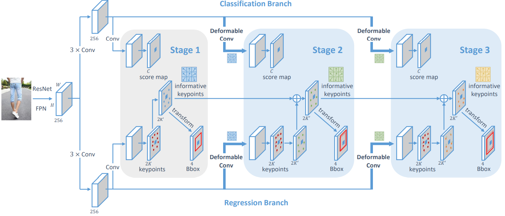

# KGDet: Keypoint-Guided Fashion Detection (AAAI 2021)
This is an official implementation of the AAAI-2021 paper "[KGDet: Keypoint-Guided Fashion Detection](https://ojs.aaai.org/index.php/AAAI/article/view/16346)".



## Installation
To avoid problems, please install this repo in a pure `conda` virtual environment.

First, enter the root directory of this repo. Install `CUDA` and `PyTorch` with `conda`.

```shell
conda install -c pytorch -c conda-forge pytorch==1.4.0 torchvision==0.5.0 cudatoolkit-dev=10.1 
```

Then, install other dependencies with `pip`.

```shell
pip install -r requirements.txt
```

#### DeepFashion2API

```console
cd deepfashion2_api/PythonAPI
pip install -e .
```

#### main code

Our code is based on [mmdetection](https://github.com/open-mmlab/mmdetection), which is a clean open-sourced project for benchmarking object detection methods.

```shell
cd ../../mmdetection
python setup.py develop
```

Now the repo is ready, let's go back to the root directory.

```shell
cd ..
```

## Data Preparation

#### DeepFashion2

If you need to run experiments on the entire DeepFashion2 dataset, please refer to [DeepFashion2](https://github.com/switchablenorms/DeepFashion2) for detailed guidance. Otherwise, you can skip to the ***Demo dataset*** subsection.

After downloading and unpacking the dataset, please create a soft link from the code repository to the dataset's root directory.

```shell
ln -s <root dir of DeepFashion2> data/deepfashion2
```

#### Demo dataset

We provide a subset (32 images) of DeepFashion2 to enable quick-experiment.

#### Checkpoints

The checkpoints can be fetched from this OneDrive [link](https://shanghaitecheducn-my.sharepoint.com/:f:/g/personal/qianshh_shanghaitech_edu_cn/EuFp4lJL_vRCpHTogM9bp9MB9WvyromlNMozlM-WIPGBvg?e=jMcJ8P).

## Experiments

### Demo

Test KGDet with 1 gpu

```shell
./mmdetection/tools/dist_test.sh configs/kgdet_moment_r50_fpn_1x-demo.py checkpoints/KGDet_epoch-12.pth 1 --json_out work_dirs/demo_KGDet.json --eval bbox keypoints
```

- Results files will be stored as `work_dirs/demo_KGDet.json`.
- If you only need the prediction results, you can drop `--eval` and its arguments.

Test RepPoints with 1 gpu

```shell
./mmdetection/tools/dist_test.sh configs/reppoints_moment_r50_fpn_1x-demo.py checkpoints/RepPointsHeadKpPlus-no_kp_loss_epoch_12.pth 1 --json_out work_dirs/demo_RepPoints.json --eval bbox
```

- Results files will be stored as `work_dirs/demo_RepPoints.json`.

### DeepFashion2

#### KGDet

**Train with 4 gpus**

```shell
./mmdetection/tools/dist_train.sh configs/kgdet_moment_r50_fpn_1x-deepfashion2.py 4 --validate --work_dir work_dirs/TRAIN_KGDet
```

- The running log and checkpoints will be stored in the `work_dirs/TRAIN_KGDet` directory according to the  argument `--work_dir`.
- `--validate` evokes a validation section after each training epoch.

**Test with 4 gpus**

```shell
./mmdetection/tools/dist_test.sh configs/kgdet_moment_r50_fpn_1x-deepfashion2.py checkpoints/KGDet_epoch-12.pth 4 --json_out work_dirs/result_KGDet.json --eval bbox keypoints
```

- Results files will be stored as `work_dirs/result_KGDet.json`.

#### Run RepPoints (Baseline)

**Train with 4 gpus**

```shell
./mmdetection/tools/dist_train.sh configs/reppoints_moment_r50_fpn_1x-deepfashion2.py 4 --validate --work_dir work_dirs/TRAIN_RepPoints
```

- The running log and checkpoints will be stored in the `work_dirs/TRAIN_RepPoints` directory according to the  argument `--work_dir`.
- `--validate` evokes a validation section after each training epoch.

**Test with 4 gpus**

```shell
./mmdetection/tools/dist_test.sh configs/reppoints_moment_r50_fpn_1x-deepfashion2.py checkpoints/RepPointsHeadKpPlus-no_kp_loss_epoch_12.pth 4 --json_out work_dirs/result_RepPoints.json --eval bbox
```

- Results files will be stored in `work_dirs/result_RepPoints.json`.

## Customization

If you would like to run our model on your own data, you can imitate the structure of the demo_dataset (a image directory plus a JSON file), and adjust the arguments in the configuration file.

## Acknowledgment

This repo is built upon [RepPoints](https://github.com/microsoft/RepPoints) and [mmdetection](https://github.com/open-mmlab/mmdetection).
